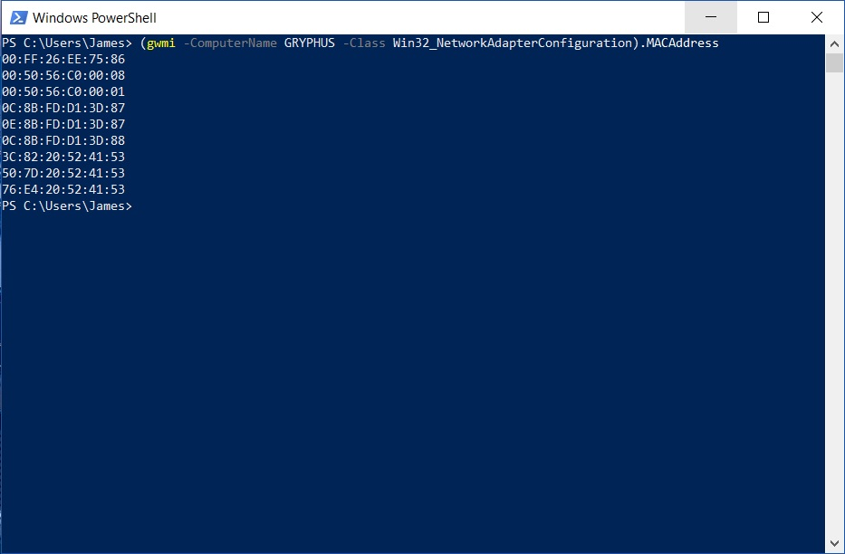
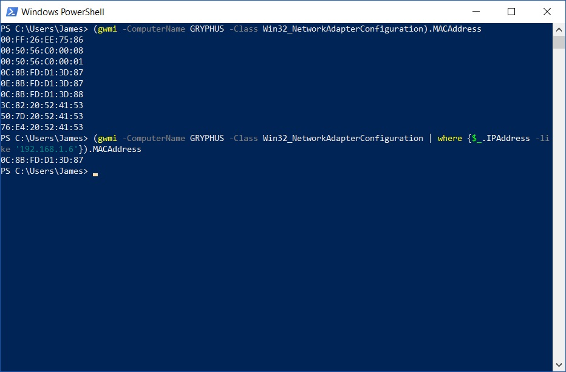
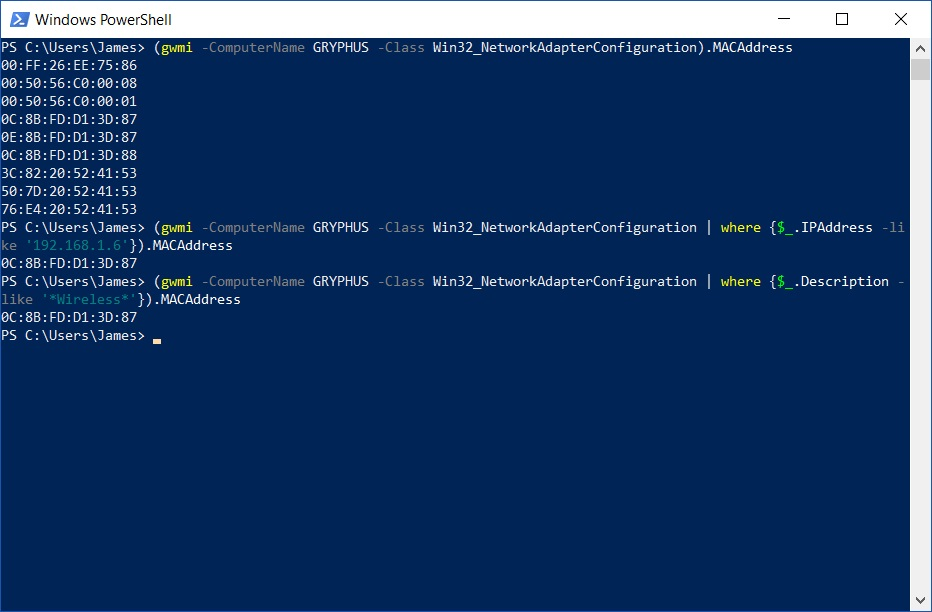

It has cropped up from time to time that we need to retrieve information, in this example, the MAC address from remotely located workstations.

While, as it goes in the world of system administration, many ways to skin such a cat, I am going to leverage both the power and versatility of Powershell combined with the vast information warehouse that is WMI (Windows Management Instrumentation).

If your remote computer is a basic configuration then we can start of something simple

```powershell
(gwmi -ComputerName DNSNAMEORIPADDRESS -Class Win32_NetworkAdapterConfiguration).MACAddress
```

In the above example, we are using the ```gwmi``` cmdlet (alias of ```Get-WMIObject``` and are interchangeable), pointing to a remote workstation with ```-ComputerName``` switch, filtered out information requested with the ```-Class``` switch, wrapping it all in brackets so we can retrieve just the returned Powershell ```MACAddress``` property.

Hopefully you will be returned a MAC Address.

However, you may find that if the device has multiple network adapters (such as teredo tunnelling for IPv6, hypervisor bridges, VPN TAPs) you are getting more noise than needed:



Never fear though, we have the technology. If you know more information about the network adapter that you want the MAC address from, we can apply filtering to the original query to bring precious to our result.

If you know the IP address of the network adapter:

```powershell
(gwmi -ComputerName DNSNAMEORIPADDRESS -Class Win32_NetworkAdapterConfiguration | where {$_.IPAddress -like '192.168.1.6'}).MACAddress
```



Or if you know the type of network adapter:

```powershell
(gwmi -ComputerName DNSNAMEORIPADDRESS -Class Win32_NetworkAdapterConfiguration | where {$_.Description -like '*Wireless*'}).MACAddress

```



There you have it. A quick little one liner that taps into the vast depth of information from the WMI database via Powershell power. It is certainly worth playing around with the properties that the above WMI query can provide in return as the information stored is vast and can lead to endless amounts of utility in your future Powershell magic.
