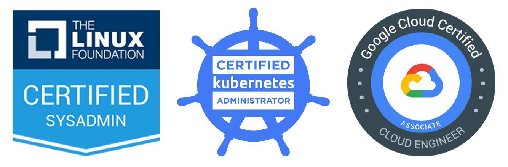

It's been a long time between drinks for certifications that I have achieved personally. While I have added a few badges to the CV via training and relevant exams through my workplace, I have to go back all the way to 2012 to when I achieved [MCITP: Windows 7]() for my last certification during my personal journey.

I figured it is time to invest back upon myself and have set about a pathway that aligns with what I enjoy playing with plus what skills I see will be valuable to me professionally. Studying, training and sitting exams can be tough to balance between everything else that life throws at you, so what better way to motivate and hold myself accountable than to announce my plans publicly.

Without further a do; over the next 24 months I hope to achieve the following certifications:

If you are no stranger to this blog, a couple of these may make a bit of sense. I've spent a incredible amount of time and fun learning about Linux operating systems through my [Raspberry Pi]() tinkerings. And no doubt you will have read my toe in the water forays with the container ecosystem of [Docker](), well Kubernetes (or K8s to the cool kids) is a enterprise grade orchestration/automation tool that sits above Docker (or other container daemons) and is available across practically every big cloud provider. Given the industry's white hot love for K8s at the present time, it makes a boat load of sense that if I want to play with containers at both a personal and professional level that I need to be intimately familiar with it. Google Cloud certification is just a nice cherry on the top. I have a desire to move this blog from a static web host setup to a more dynamic configuration that leverages containers and K8s. With that in mind, GCP as a platform seemed to fit the bill and thus, if I am going to spend a considerable amount of time on the platform, I might as well reap the rewards of that experience in becoming certified.

Well that is enough yapping for the time being, time to get stuck in and knock Linux Foundation Certified Sysadmin on the head. No doubt, I will be sharing my findings, nuggets and light bulb moments as I encounter them here, on the blog.
