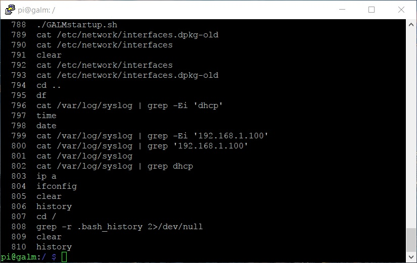
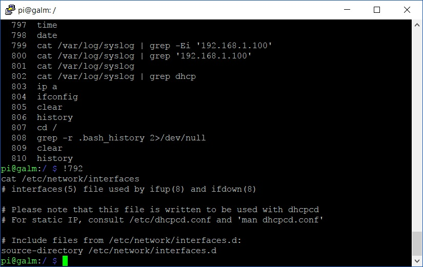
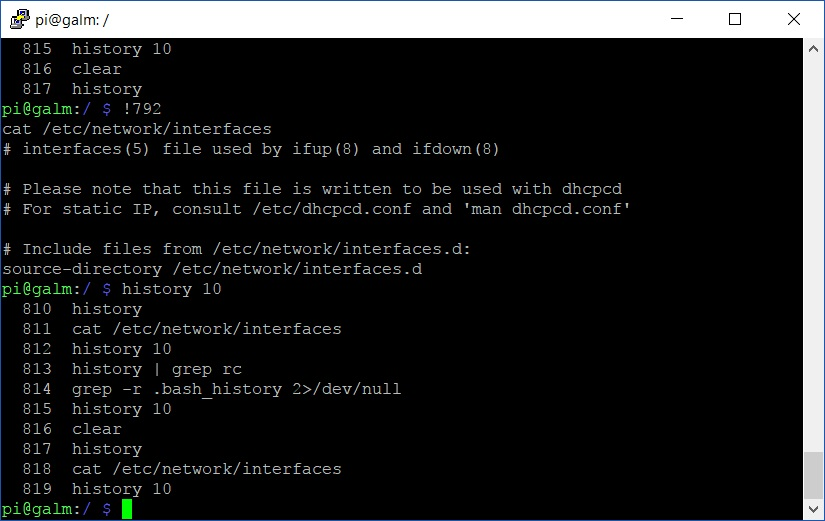
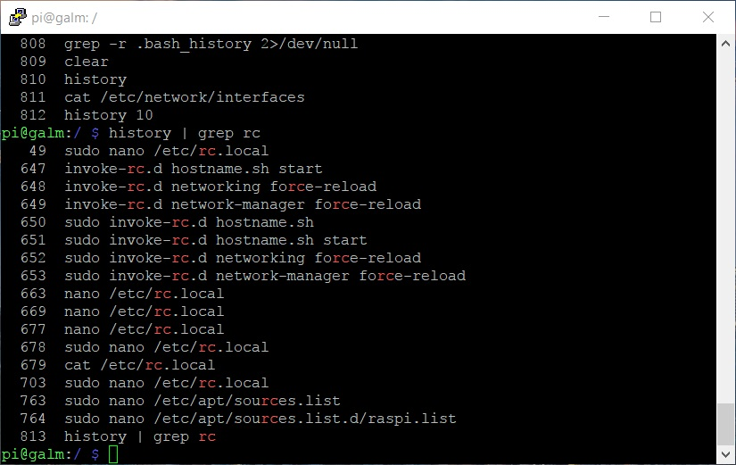

Ever spent endless hours, days and nights, deep inside your Bash shell in your Linux distribution of choice and ever wonder "I know I have ran a command to solve this solution but cannot for the life of me remember it"? Using your up/down arrow keys can only get you through so much of your history before it gets pointless, especially if the command was ran a long time ago.

Thankfully in Bash, there is a command for that.

```History``` command outputs the contents of the hidden_.bash\_history_ file that is located in each users folder in a numbered form.



The brilliance of this number format is that it provides to us the convenient ability to quickly execute a command from your Bash history using the following convention:

```bash
!NumberOfCommandToExecute
```

So, if we take from the example output above and wanted to execute the ```cat``` of my network interfaces file at line 792, I would do the following:

```bash
!792
```



Very handy indeed.

So what if you knew you executed the command you want very recently and didn't want to list the 800+ entries of your Bash history like mine outputted? Well the ```history``` command will display the last _X_ amount of entries simply by typing:

```bash
history x
```

So the last 10 entries would look like:



So overall a pretty powerful command in your Linux tool set.

But none of this solves our original scenario. This is where our friend ```grep```, which we explored in [a previous post](), comes into play.

Often after a period of time I want to reevaluate what I am getting to startup upon my Raspberry Pi booting. Now, I know that there is a file where I defined this with the term 'rc' in the file name but often forget the full name and/or where it is located. Perfect use case for combining with a pipe ```history``` and ```grep```.

If we do the following:

```bash
history | grep rc
```

we should be given exactly what I am after. Low and behold:



_/etc/rc.local_ is exactly what I am looking for.

As you can see, using ```grep``` to trawl your Bash ```history``` is a powerful partnership in a Linux SysAdmin's belt of magic.
