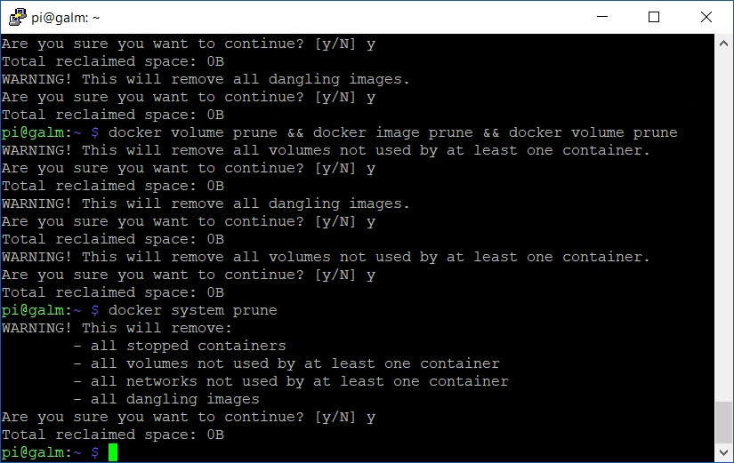

[Previously]() we have covered what to do if you made a real mess of things in Docker and just want to purge all your containers, volumes and images from your host system. What happens though if you have active running containers and don't want to bring them down but still want to do some spring cleaning? Well, Docker has come a long way in recent times and now there happens to be a non destructive way to go about it.

## Remove all non-running containers

```bash
docker containers prune
```

## Remove all not in use volumes

```bash
docker volume prune
```

## Remove all not in use images

```bash
docker image prune
```

Are you sensing a theme yet? Although we touched on the prune command previously, it was in conjunction with the destructive _\-f_ , force switch. Now, you could pound out all the above commands into your shell one by one but if you want a quick and easy clean of all elements in one foul swoop?

## Remove all containers, volumes, images and networks not in use

```bash
docker system prune
```

Compare the pair:

 Definitely much shorter, sweeter and a whole lot more (IT) lazier. Just the way a SysAdmin likes it.
