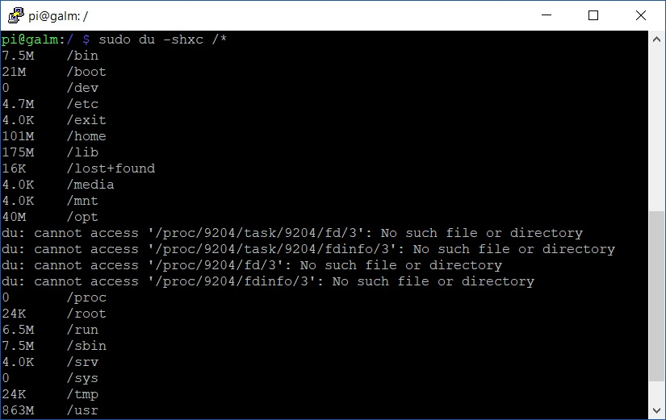
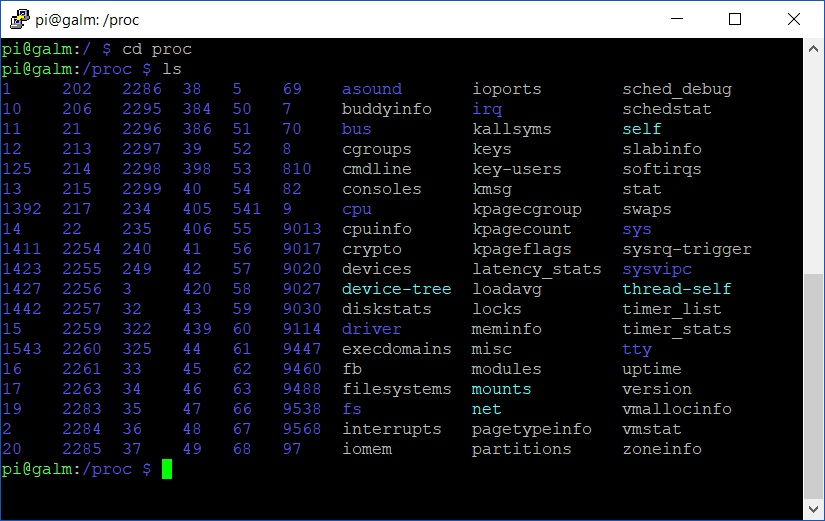
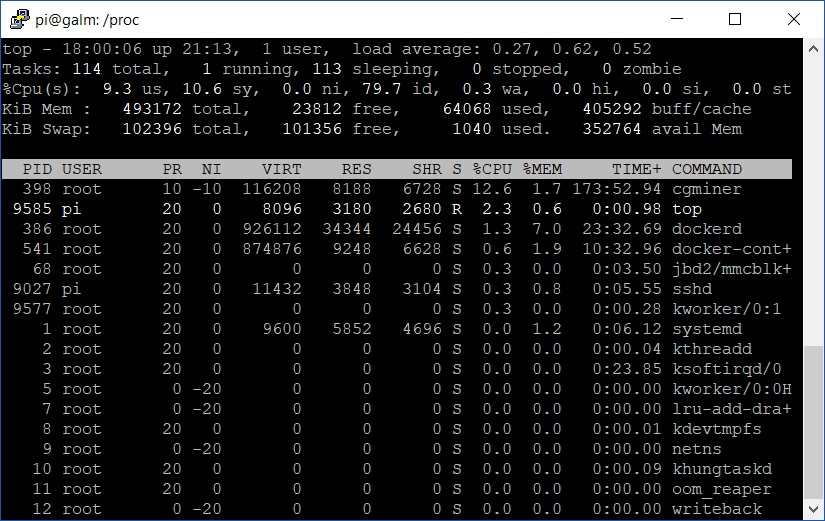
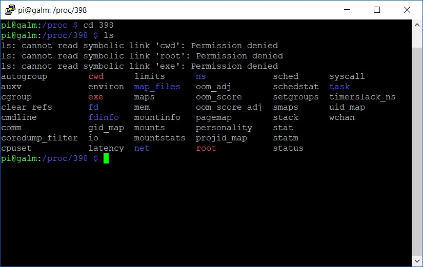
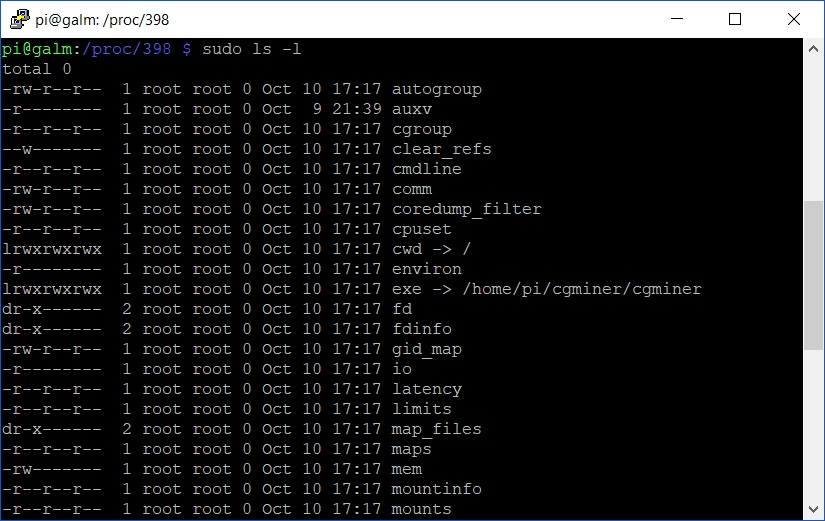

Despite the Linux operating system being available in various and unique flavours and spins, many of the foundations that make up the operation system have similarities between them all. The filesystem, namely, the structure of the filesystem of Linux operating systems share common makeup thanks in due part to the [Filesystem Hierarchy Standard](https://refspecs.linuxfoundation.org/FHS_3.0/fhs-3.0.pdf) policy document maintained by the Linux Foundation. The vast majority of distributions follow the model set out in the document, after all, it is largely for their benefit. The more distributions that follow and baseline their filesystem against this standard the more consumption from users and enterprises they will experience thanks to familiarity with known, expected standard.

Today, I thought we would kick off with a rather unique and important directory that should be in any SysAdmin's toolkit:

## **/proc**

The **/proc** directory is a special directory that contains pseudo-files that contain properties of various aspects across the system. Ordinarily. these pseudo files contain no data at all.

We can confirm this is the case via two means. First, let's do a quick size count across the top level directories including **/proc**;

```bash
sudo du -shxc /*
```



As you can see, **/proc** run a total of 0 bytes storage on the above Raspberry Pi.

But wait, let's backup a second, what is this ```du``` command?

```du``` is a disk space usage estimator utility available on most Linux systems. The simplest usage of ```du``` is simply;

```bash
du /path/to/location/to/estimate
```

However, in the example above, we make use of a number of switches.

- _-s_  summaries the results per directory versus providing the disk space usage for each file under the directory
- _-h_  provides the results in a human readable format by converting the result to the highest unit of disk space rather than just display in bytes
- _-x_  excludes directories on different file systems. Not so applicable on Raspbian but it’s a good habit to get into when used against other distros
- _-c_ provides a grand total at the end of your resulting estimate

Try for yourself on your local \*nix box.

Back to **/proc**; if we jump into it and list the contents on your system, the most obvious thing you will notice at first glance is a huge amount of folders named by numbers:



Each of the numbered named folders represents a process currently running on the machine, more specifically, with their PID (Process ID). We first explored PIDs way back in [part 2 of my mining Bitcoins post]() with the ```top``` utility. If we quickly bring up ```top``` now and look for a interesting, running process, say _cgminer..._



...we can see it has a PID of 398.

Now let's open the corresponding directory under **/proc** and see what we can find:



Thanks to the permission error, immediately we know we have a couple of symbolic linked directories in _cwd, exe_ and _root_**.** _cwd_ is the current working directory of the process; _exe_ is the full path to the executable that the process is spawned from and _root_, quite simply, is the slash root path, otherwise known as **/**.

We can easily see where the symbolic linked directories go to with the following command:

```bash
sudo ls -l
```



The next part will continue to explore the other directories within the process together with the rest of **/proc**. Until then, keep on kicking goals!
