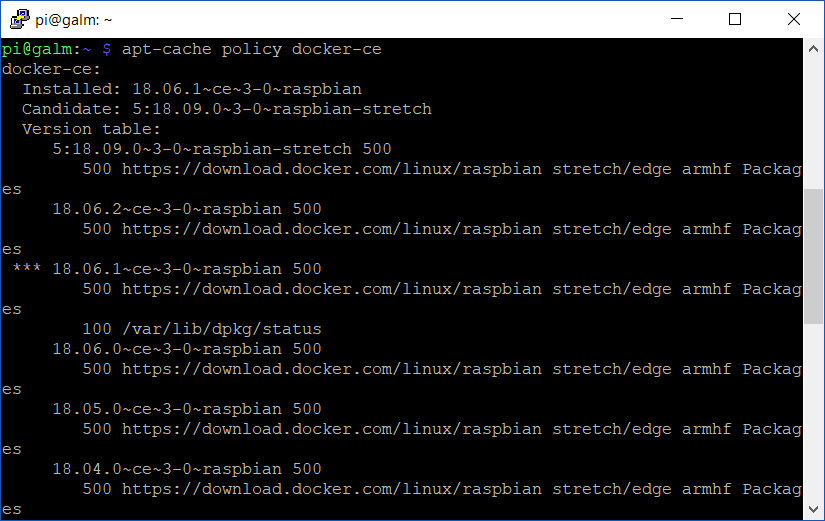
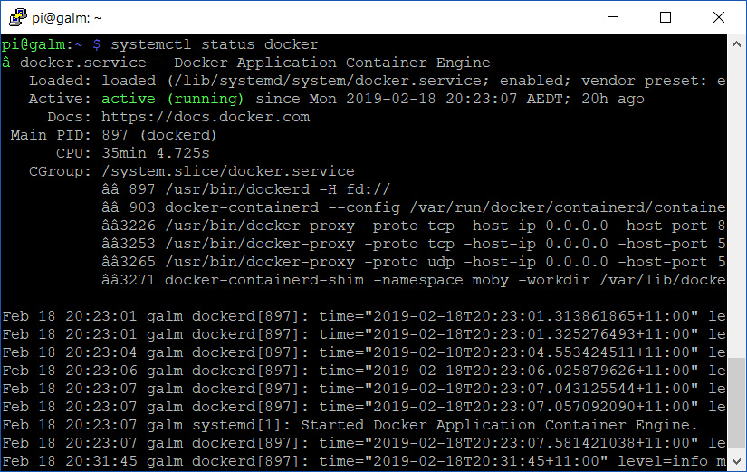

Have you recently attempted to install the containerization platform known as Docker on to a first generation Raspberry Pi (including A+ and B+) or a Zero and found you couldn't start up a container? Maybe you were trying your hand at [deploying a internet advertising blackhole, Pi-Hole]() of your own? Whenever you attempt to integrate the daemon, you are met with less than positive responses?

Try checking the SystemD service logs for Docker with the following command:

```bash
journalctl -u docker.service
```

Did you see any errors? Something similar to the below?

```shell
Feb 18 20:07:24 raspberrypi systemd[1]: Starting Docker Application Container Engine...
Feb 18 20:07:27 raspberrypi systemd[1]: docker.service: Main process exited, code=dumped, status=11/SEGV
Feb 18 20:07:27 raspberrypi systemd[1]: Failed to start Docker Application Container Engine.
Feb 18 20:07:27 raspberrypi systemd[1]: docker.service: Unit entered failed state.
Feb 18 20:07:27 raspberrypi systemd[1]: docker.service: Failed with result 'core-dump'.
Feb 18 20:07:27 raspberrypi systemd[1]: Stopped Docker Application Container Engine.
```


It seems you have run in to the core dump / segmentation fault issue that is facing a lot of people across the community and is currently being explored over at the Moby (open source project for Docker) [Github](https://github.com/moby/moby/issues/38175).

Fortunately there is a relatively easy work around. So if you are experiencing the above, follow the bouncing ball below to get back up and running.

## Remove latest version of Docker

Utilising the ```purge``` command for from the **apt** package manager, we will clear out all instances and related applications for the community edition of Docker:

```bash
sudo apt-get purge docker-ce
```

## Update apt cache and identify older version of Docker

While not strictly required, it's worth noting how to use this feature of **apt** in future situations. First, update the cache of available applications with:

```bash
sudo apt-get update
```

Next, we will check what versions of Docker are available for installation with:

```bash
apt-cache policy docker-ce
```

You should get a similar output to the below whereby the installed version, followed by which version will be installed next (read: candidate) if you perform a _sudo apt-get upgrade_ are listed at the top. Lastly, what versions in the apt cache catalogue are available for installation are listed out:



You'll note the currently installed version is highlighted in the list of available versions with \*\*\* prior to it's listing.

## Install known working version of Docker

Based upon the feedback in the GitHub issue tracker, it's a safe bet to install version **18.06.2**. Let's go ahead and install with the following command:

```bash
sudo apt-get install docker-ce=18.06.2~ce~3-0~raspbian
```


Earlier version of this post had listed 18.06.1 as the recommended version to install but having since tested 18.06.2 which includes fixes for [CVE-2019-5736](https://nvd.nist.gov/vuln/detail/CVE-2019-5736)    
successfully, I have since changed the recommendation.


As you can see, it's very simple to specify a specific version of a application. All you need to do is add _=versionnumber_ to the typical ```apt-get install application``` command and it's done.

## Confirm working Docker status

Now that we have the known working version of Docker installed. Let's double-check our work by entering the following to get the Docker daemon's status:

systemctl status docker

If you are all up and working, you should see _active (running)_ like the below image:



No more segmentation faults, just back in business.
