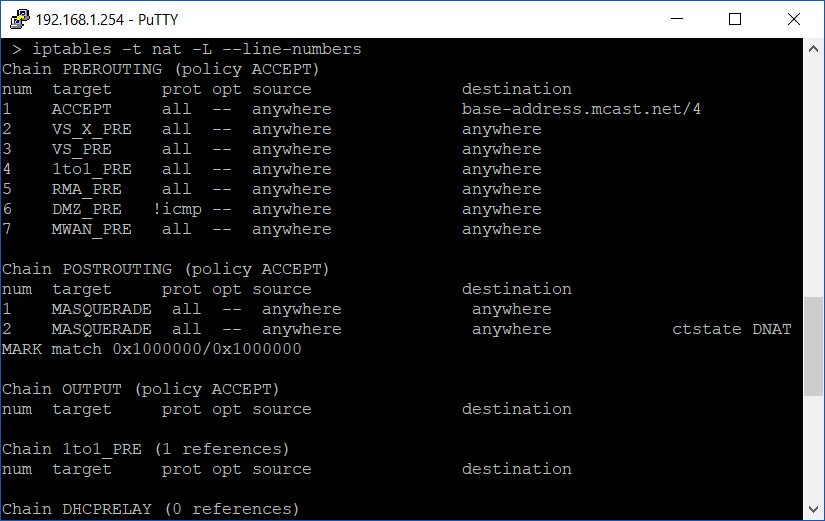
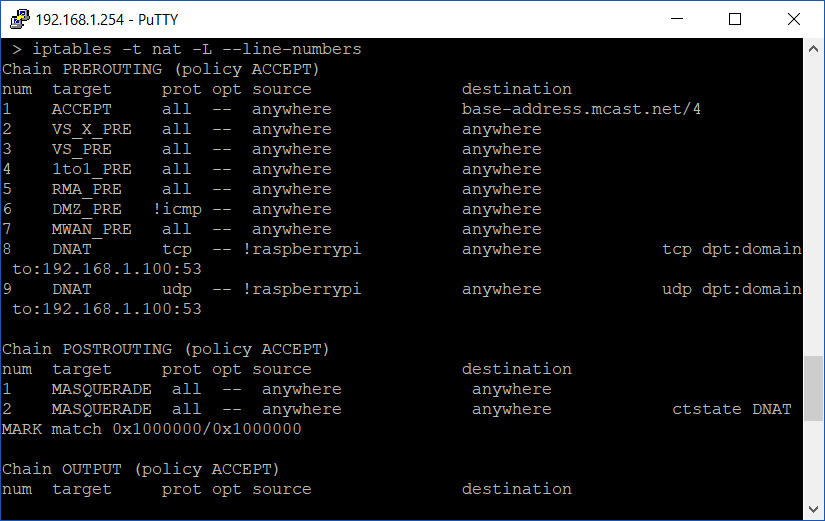

Hopefully by now you have heard the good word [about Pi-Hole](), set one up in a Docker container and now enjoying a substantially ad-less and speedy internet experience across all your devices.

If you were one of the ones to configure your Pi-Hole at your routers end to have all the devices on your network use Pi-Hole then while 98% of the time this is enough, you may be surprised to learn that some off the shelf devices and/or software like to hardcode a DNS server of their choice. This means that even if your router is informing all clients via DHCP that they should use your Pi-Hole for DNS, they will be going around it and potentially leaking personal information or data you have chosen not to share.

One such device that is common across households is the humble Google Chromecast. Now, I love my Chromecast. It's a fantastic device to bring quick, simple and easy video streaming to anything with a HDMI input. That said, it has Google's DNS servers hardcoded into the device and thus bypasses the Pi-Hole when making DNS queries. Hell, even one of the [creators of the DNS system voiced his displeasure](https://mailarchive.ietf.org/arch/msg/dnsop/WCVv57IizUSjNb2RQNP84fBclI0) about the leaking of information that could conspire.

Like anything in the world of IT, where there is a will, there is a way; Today, that is the way of **iptables**

For this little exercise, we are going to assume that you are either:

- Utilising a router that runs OpenWRT
- Utilising a router that runs another Linux distro, allows SSH access and includes **iptables** in its operating system

**iptables** for the uninitiated is a Linux application that allows you to configure the Linux kernel firewall via a table or tables of chains & rules. Essentially each network packet that transfers through the Linux kernel is sent through various chains of rules depending upon it's origins to correctly route it to it's destination.

We will use **iptables** to ensure that all DNS query packets, no matter if they are explicitly configured to go around the Pi-Hole will be re-routed to the Pi-Hole for filtering or pass-through to our defined DNS provider.

## List current rules in iptables

First off, SSH into your router and login to have administrative privileges.

Next, enter the following command to list all rules inside the NAT table inside iptables:

```shell
iptables -t nat -L --line-numbers
```



Take note of the current output of the PREROUTING chain.

## Entering new rules in iptables

Next, we are going to add two rules; one rule for TCP packets and one rule for UDP packets by entering the following:

```bash
iptables -t nat -A PREROUTING -i br0 -p udp ! --source piholeaddress ! --destination piholeaddress --dport 53 -j DNAT --to piholeaddress

iptables -t nat -A PREROUTING -i br0 -p tcp ! --source piholeaddress ! --destination piholeaddress --dport 53 -j DNAT --to piholeaddress
```

Replace ```piholeipaddress``` with the IP address of your Pi-Hole before entering.

Before we go any further, let's break down these rules to get an understanding of what is happening:

```shell
iptables -t nat
```

We are invoking ```iptables``` and addressing the NAT table

```bash
-A PREROUTING
```

and making an addition to the PREROUTING chain

```bash
-i br0 -p tcp
-i br0 -p udp
```

while listening on interface br0 (typical bridge interface that is your WAN port on your home router) for packets of the TCP or UDP protocol variety

```bash
! --source piholeaddress ! --destination piholeaddress --dport 53
```

and the source of the packet did **NOT** come from the Pi-Hole (to prevent loops) and is **NOT** heading to the Pi-Hole (precisely the traffic we want to capture and reroute) but it's destination is port 53 (DNS port)

```bash
-j DNAT --to piholeaddress
```

jump (move to the next chain) and destination NAT the packet to the Pi-Hole.

There are almost limitless ways you could construct your rule but I found this is the most streamlined and efficient way to capture traffic that is attempting to go around the Pi-Hole for DNS lookups.

When you correctly enter the rule, you will receive no output/prompt from iptables. So let's confirm ourselves by displaying the NAT table again:



Now we can see two DNAT rules under the PREROUTING chain.

At this point, all DNS queries bound for port 53 attempting to exit your router will be redirected to your Pi-Hole and filtered if necessary. Happy days!

## Removing rules in iptables

But what do you do if you stuffed up the rule in **iptables** and now your internet is no longer functioning? We'll discuss that in the [next post]().
