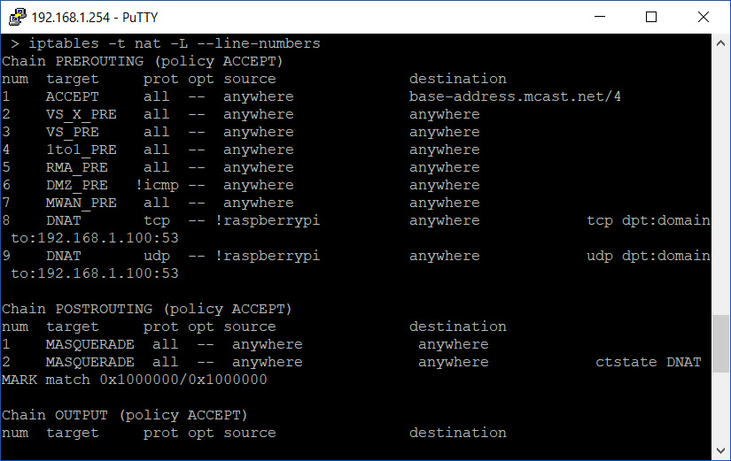
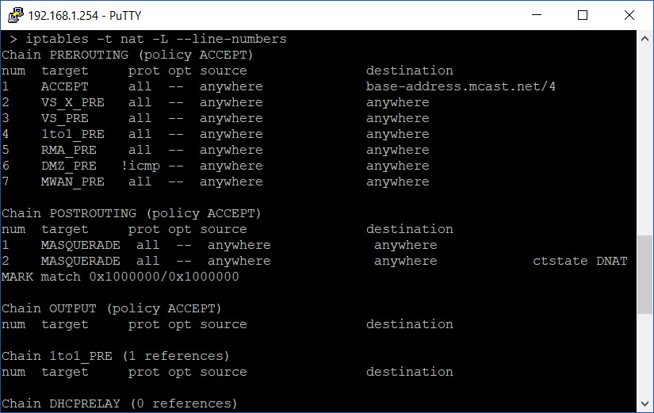

So you've had a go at entering the wonderful world of **iptables**, with its chains, rules and of course tables. But unfortunately for you it has gone all horribly wrong and now you have no internet!

Firstly, how are you here? More importantly; Thankfully iptables is built with such a situation in mind. Simply restart your router and **_\*smoke bomb\*_** the newly entered rules vanish.

But you, as a fellow Sysadmin, might still have access to the router. You as a Sysadmin CAN fix this. You just need to know how right? Let's get rid of those offending rules and back to browsing memes shall we?

Let's look back at the list from the NAT table you produced after entering the new rules.

```bash
iptables -t nat -L --line-numbers
```



Can you see how there is a number at the start of each line? In the example above, the new rules are line number 8 and line number 9.

At the same prompt, enter the below to remove the rules:

```bash
iptables -t nat -D PREROUTING 9

iptables -t nat -D PREROUTING 8
```

If entered correctly, no prompt will be given.

When removing rules, take care to enter the removal of said rules from the **highest number and then descend down the table**. If you deleted rule 8 before you deleted rule 9, rule 9 would become rule 8 as it is no longer there in the table. This can lead to you deleting rules you never meant to remove.

Verify your work once more with a NAT table output:

```bash
iptables -t nat -L --line-numbers
```



You should be back to square one and internet restored.
