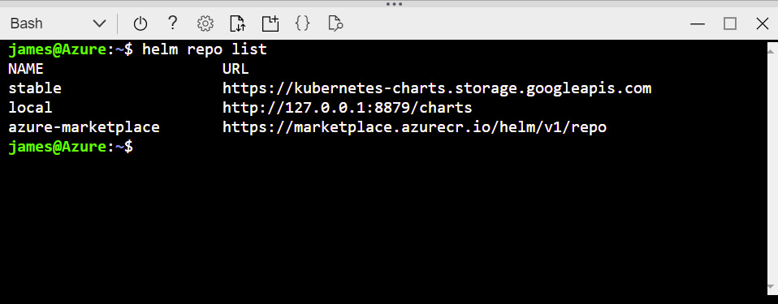

With the vast majority of cloud providers reaching a certain age, the maturity of their individual service offerings is almost a given. One such service that has grown at a rapid rate in terms of both advancement and adoption is Kubernetes.

Kubernetes; Pitched in some circles as an abstraction layer for the datacenter (as opposed to hypervisors being the abstraction layer for compute/storage layers). This is because of it's ability to orchestrate both deployment of applications, it's dependencies and manage it through its life-cycle through container technologies married together with multiple network layer delivery methods such as gateways, ingress/egress and inter-application communication.

Despite the advancement of Kubernetes as a platform, it can certainly be a handful to operationalise at a scale and complexity necessitated by enterprise environments.

## Enter the PaaS

Like all major cloud vendors, Microsoft Azure has it's own flavour/spin on Kubernetes in a managed platform aptly named, **A**zure **K**ubernetes **S**ervice. PaaS Kubernetes offerings are really fantastic way to take advantage of the benefits that Kubernetes without the traditional system administration overhead (securing, patching, scaling etc...).

Today, I'm going to show you how to combine the AKS platform, with the package management suite, Helm, to deploy a Wordpress blog, backed by MariaDB via the Azure CLI interface. This can certainly be done via the Azure Portal web interface but there isn't much fun or automation to be had that way.

Either via the Cloud Shell or after [installing](https://docs.microsoft.com/en-us/cli/azure/install-azure-cli?view=azure-cli-latest) on your local workstation and [logging into your Azure subscription](https://docs.microsoft.com/en-us/cli/azure/authenticate-azure-cli?view=azure-cli-latest); enter the following to create a Resource Group for the AKS service:

## Deploy AKS

```bash
az group create --name RESOURCEGROUPNAME --location AZUREREGION
```

Next, we are going to establish the managed Kubernetes cluster with 3 nodes and send the endpoint to the previously create Resource Group:

```bash
az aks create --name CLUSTERNAME --resource-group RESOURCEGROUPNAME --node-count 3 --generate-ssh-keys
```

After the cluster has been established, let's get the generated keys into our shell's profile with:

```bash
az aks get-credentials --name CLUSTERNAME --resource-group RESOURCEGROUPNAME
```

## Deploy Helm to the AKS cluster

Now that we have established a AKS cluster, ready for some containers to be orchestrated, it's time to get Helm involved.

From recent experience, Helm has been added to the base Cloud Shell image and doesn't require installing. If you are following along at home with the Cloud Shell, you can skip this next step. For those of you BYODing the shell, download and install Helm with the following:

```bash
curl https://raw.githubusercontent.com/kubernetes/helm/master/scripts/get > get_helm.sh
chmod 700 get_helm.sh
./get_helm.sh
```

A service account needs to be created for Helm's server-side component, Tiller and binded to the cluster admin role so it is able to implement configuration specified by the chart of choice:

```bash
kubectl create serviceaccount -n kube-system tiller
kubectl create clusterrolebinding tiller-cluster-rule --clusterrole=cluster-admin --serviceaccount=kube-system:tiller
```

With the basics configured, we can initiate Helm. In doing so, this will deploy Tiller to our AKS cluster:

```bash
helm init --service-account tiller
```

## Deploy Wordpress to AKS with Helm

With the groundwork laid, we can get to the real reason we are here and deploy us some Wordpress containers!

We are going to start off by creating a empty secret file for a Helm package (or **chart**, as it be known) to fill:

```bash
kubectl create secret generic emptysecret --from literal=.dockerconfigjson='{"auths":{"marketplace.azurecr.io":{"Username":"","Password":""}}}' --type=kubernetes.io/dockerconfigjso
```

Again, if you are playing along at home with the Azure Portal based, Cloud Shell, this next step isn't necessary. But those running a local copy of Helm, we'll need to add the Azure Helm repo by doing the following:

```bash
helm repo add azure-marketplace https://marketplace.azurecr.io/helm/v1/repo
```

And now, if you do a ```helm repo list``` commmand, you should be presented with something like this:



With the necessary repo now available, let's hit the big red button and get Wordpress onto this cluster:

```bash
helm install azure-marketplace/wordpress --set global.imagePullSecrets={emptysecret}
```

## Check AKS pod health

Your shell should be filled with a whole stack of info on the deployment but we can safely ignore that for the time being and focus on what you need to know about your deployment.

First off, we need to know when the deployment is complete and ready for consumption. How do we do that? Punch in the following:

```bash
kubectl get pods -w
```

This will continually poll the status of our Kubernetes pods. What we are after is when all the pods (both Wordpress pods and MariaDB pod) are up and running like the below:


Next, we want that all important IP address so we can access the Wordpress installation. We can get that by querying the service and noting the Load Balancer's externally facing IP address:

```bash
kubectl get service
```


## Customise Wordpress

A freshly built, scalable, high resilient instance of Wordpress running on Azure Kubernetes Service. The only thing left to do is log in to your new blog and start using it.

But you were never presented with the Wordpress first run sequence to configure one...

Not to worry, note down your Wordpress pod name from the previous command and extract the password generated at runtime by the Helm chart deployment with the following:

```bash
echo Password: $(kubectl get secret --namespace default WORDPRESSPODNAME -o jsonpath="{.data.wordpress-password}" | base64 --decode)
```

Magically isn't it?

Next up, we'll delve deep into how to make use of Azure AKS's scalability to ensure our Blog can handle the load of your impending popularity!
