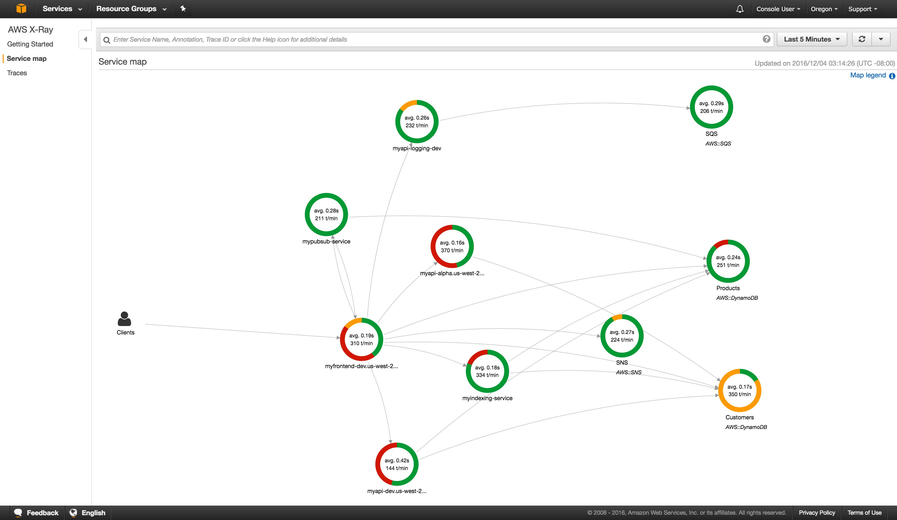
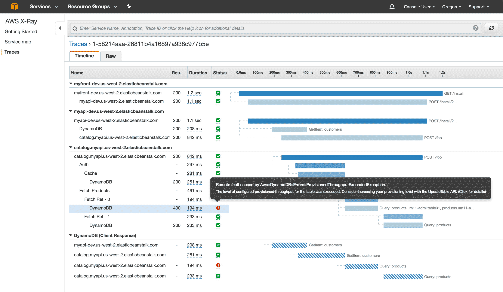

Right, [we now know]() that we lack observability in our intricate fabric of container spaghetti and the boss wants answers on our unknown unknowns. You've heard about these hot, young things called Services Meshes. But what exactly are they?

## Service Mesh Architecture
Service Meshes, employ what is commonly referred to as a sidecar with your container, function (or even traditional virtual machine depending on your flavour). These sidecars, sit, side by side with your service and act as a proxy between other services, routing traffic securely, applying polices against that traffic together with gathering metrics and data.

Paul ([@pbouwer)](https://twitter.com/pbouwer) from Microsoft delivered an excellent presentation on the pros and cons of the top 3 Service Meshes in the container landscape (being Istio, Linkerd and Consol) in which included the below fantastic visualisation of a service mesh architecture including sidecars:

")

Employing these sidecars offloads the operational responsibilities from the Developers, their code and potentially, application libraries and put its back to the infrastructure/platform layer with minimal, to no, code requirements. This is immediate value to an organisation in that our Developers focus is solely on service delivery via application engineering, rather than operational requirements of logging, tracing and debugging.

## Observability via Service Meshes

Once you start employing a service mesh, the visualisation of your services provides contextual data to answer those all important questions on performance, root cause analysis and fine-tuning of services.

A great example of this was shown by the dynamic duo of Prateek ([@pnyak_](https://twitter.com/pnyak_)) & Arjen ([@ArjenSchwarz](https://twitter.com/ArjenSchwarz)) of Innablr & DigIO respectively. With a basic website delivered via serverless containers on AWS's Fargate service, the team demonstrated how they were quickly end easily able to pinpoint the source of slowness with the combination of AWS's AppMesh and X-Ray services. Other service mesh products combine the mesh (sidecar) layer with the tracing, metrics and data ingestion layer in one big package but Amazon have segregated to two for...reasons?

To give an insight into how quick and easy it was, take a look at this example visualisation from AWS's product page for X-Ray. First off, we have the service map page which provides a nice topology visualisation showing the interconnected containers/functions:

Once you spot something not quite right (this example has a few), you click on that particular instance. That will bring you to the Traces page that allows a quick root cause analyses to be performed.

The greatest win I see from Service Meshes is that it can quickly be used to determine where best to tweak, tune or considerable change your interconnected web that makes up a service to improve the customer experience. It doesn't necessarily have to be about responding to complete failures.

This is exactly what Prateek and Arjen demonstrated with their demo website. It was responding to customer input (so no failure), it just wasn't performing like you would come to expect.

Hopefully the above has given you a better understanding on the what and why to the Service Mesh madness. Now the only thing left to do, is to choose one that is right for you. Knowledge is power and I've got more coming to help you answer that very question in the next post in my Container Camp series.
