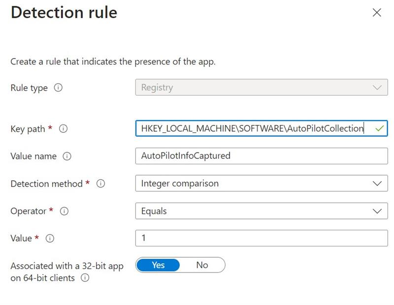

As part of a project to consolidate 3 organizations into 1 new organization, we decided as part of the IT consolidation, end user would go through a reset and re-register process to migrate their device from either BYOD or old environment corporate (Intune) managed to new environment corporate (Intune) managed. This process would occur over a short window of time (such as a weekend) for all users.

While sounding simple enough on paper, there are some snags along the way that will need to be addressed. One big one being how do we migrate the AutoPilot v1 device hashes from the device's old Intune environment to the new one? Microsoft doesn't allow you to extract this enmasse from Intune currently. This leaves us with the only option to touch each device individually.

Sounds like a job requiring a bit of automation no?

## What are we working with?

One thing Microsoft do provide is a [ready-made PowerShell script](https://www.powershellgallery.com/packages/Get-WindowsAutopilotInfo/3.9) to extract the device hash from a device. Okay, this is a starting base to work with.

We also know that Intune likes to import Autopilot device hashes as a [particularly structured CSV file](https://learn.microsoft.com/en-us/autopilot/add-devices#ensure-that-the-csv-file-meets-requirements).

So we know how to output what we need and what are the import requirements, know we need to build out some scale in the process to collect the output and input in minimal steps (given the short window of time).

## Solutioning time

Since we are already dealing with PowerShell and data structured in table form, sounds like the perfect excuse to use Azure Tables! 

From a 10,000ft view, we need to build something that will look like the following:

<div style="background-color:white; padding: 20px">

flowchart BT
subgraph Org1 [Old Organisation 1]
EU1[End user device 1] --> PS1[/Get-WindowsAutopilotInfo.ps1/]
end
PS1 --> DB[(Azure Table)]
subgraph Org2 ["`Old Organisation *n*`"]
EU2["`End user device *n*`"] --> PS2[/Get-WindowsAutopilotInfo.ps1/]
end
PS2 --> DB[(Azure Table)]
subgraph Org3 [New Organisation]
DB --> IA[Intune Autopilot]
end

</div>

## Build some infra

Okay, we have declared that Azure Tables shall provide the central storage of our device hashes for import into the new organisations Intune. Let's quickly build a Storage Account, associated Table Service, Table and output a service level SAS key to be used by our device-level PowerShell to send up the device hash. We can do this by flexing some Bicep skills.

Save the below as a ```.bicep``` file.

```bicep
@maxLength(24)
@minLength(3)
@description('Specifies the name of the Azure Storage account.')
param storageAccountName string = 'autopilot${uniqueString(resourceGroup().id, deployment().name)}'

@description('Specifies the name of the Azure Table.')
param tableName string = 'autopilotinfo'

@description('Specifies the expiry of the service level SAS key.')
param tableSasExpiry string = '2025-01-01T00:00:00Z'

@description('Specifies the location in which the Azure Storage resources should be deployed.')
param location string = resourceGroup().location

resource sa 'Microsoft.Storage/storageAccounts@2023-01-01' = {
  name: storageAccountName
  location: location
  sku: {
    name: 'Standard_LRS'
  }
  kind: 'StorageV2'
  properties: {
    accessTier: 'Hot'
  }
}

resource tableServices 'Microsoft.Storage/storageAccounts/tableServices@2023-05-01' = {
  parent: sa
  name: 'default'
}

resource table 'Microsoft.Storage/storageAccounts/tableServices/tables@2023-05-01' = {
  parent: tableServices
  name: tableName
}

var sasConfig = {
    canonicalizedResource: '/table/${sa.name}/${table.name}'
    signedPermission: 'rau'
    signedExpiry: tableSasExpiry
    signedProtocol: 'https'
    keyToSign: 'key2'
}

output sasToken string = sa.listServiceSas(sa.apiVersion, sasConfig).serviceSasToken
```

To kick off the deployment, create the necessary resouce group; for example:

```bash
az group create --name Autopilot-RG --location "Australia East"
```

Now let's deploy our bicep file (in this example, the above bicep was saved as *deployaztable.bicep*):

```bash
az deployment group create \
  --name AutopilotTableDeployment \
  --resource-group Autopilot-RG \
  --template-file deployaztable.bicep \
  --output none
```
and note, when successfully deployed, in the outputs section, our service-level SAS key is displayed to access the table with later.

```json
    "outputs": {
      "sasToken": {
        "type": "String",
        "value": "sv=2015-04-05&spr=https&se=2025-01-01T00%3A00%3A00.0000000Z&sp=rau&tn=autopilotinfo&sig=VG6pu3gpLNPMqPJGxopOntXX%2BgMWzQJdCRxqCr6EN4A%3D"
      }
    },
```


The output gets a bit messed up, specifically, any time codes within the SAS key. Make sure to convert those **%3** in the ```se=``` section to **:**


## Extract the hash

With our central storage for the device hashes sorted, now we need to piece together something that will extract said device hashes and upload to the Azure Table, and do so in a scalable way.

We already have the extraction method sorted with the provided ```Get-WindowsAutopilotInfo.ps1``` PowerShell script, so let's dig into the script and extend upon it.

Fortunately, the script has a great level of detail, including examples built in. A quick glean of this shows that, without any paramaters defined, the script will extract the necessary information via WMI from the local host and output back to the Shell as a object:

```powershell
# Create a pipeline object
$c = New-Object psobject -Property @{
    "Device Serial Number" = $serial
    "Windows Product ID" = $product
    "Hardware Hash" = $hash
}
```

Perfect, this means we can easily manipulate with PowerShell to do what we need.

Now we just need to take this outputted object and send it to the Azure Table. Enter [AzTable](https://www.powershellgallery.com/packages/AzTable/) module.

Now, this module is a bit of a weird one. It's somewhat official (copyright is Microsoft Corp) but the PowerShell Gallery specifically references a personal website that no longer works...

Never fear, as [Microsoft Learn](https://learn.microsoft.com/en-us/azure/storage/tables/table-storage-how-to-use-powershell) has some example on how to use the module. But if your experience is anything like mine, you'll quickly find out the method described to authenticate and retrieve a table doesn't work.

Most likely, this is centered around that tables use a authentication abstraction referenced as *Context*. The documentation retrieves this context during the creation of a example storage account that the table lives in.

The documentation does not provide any steps of getting this context for existing tables.

Yikes

Fortunately, the internet take away but also giveth. Microsoft MVP Travis Roberts provides a [great example](https://www.ciraltos.com/write-data-from-powershell-to-azure-table-storage/) of how to connect to existing Storage Accounts and Tables within via the creation of the context object:

```powershell
# Step 2, Connect to Azure Table Storage
$storageCtx = New-AzureStorageContext -StorageAccountName $storageAccountName -SasToken $sasToken
$table = Get-AzureStorageTable -Name $tableName -Context $storageCtx
```

With authentication sorted, now we just need to write our table data. For that, we need 4 key elements:

- ```table```
  - This is our Azure Table. Already retrieved as part of our context building earlier
- ```partitionKey```
  - Partition Keys enable us to separate data into several, you guessed it, partitions. This is not needed in our case so our key will all be the same
- ```rowKey```
  - Row Keys are a unique identifier for each table data entry. ```New-Guid``` will be handy here
- ```property```
  - This is our meat and potatoes, our Autopilot data including the hash will go here. This is in a format of hashtable.

With this knowledge, we can place these puzzle pieces together into a single PowerShell script that will install our dependencies needed for each script/module to work, connect to our table, retrieve the Autpilot hash and take that output and enter as a new row to our table. Without further ado, LFG:




Two things to call our in the script.

1. Azure Tables don't enjoy spaces in their column headers. This is why, when writing to the table row, we are not using the the names defined in the object as outputted from ```Get-WindowsAutopilotInfo.ps1```:

```powershell
-property @{"DeviceName"="$($env:COMPUTERNAME)";"SerialNumber"="$(($Autopilot).'Device Serial Number')";"Hash"="$(($Autopilot).'Hardware Hash')"}
```

2. Jumping a head a bit but we will deploy this script at scale with Intune as a Win32 package and thus, to help detect it's successful execution, we are writing a value to the registry to check against:

```powershell
# Set detection key to indicate script has run
New-Item -Path 'HKLM:\SOFTWARE\AutoPilotCollection' -Force
New-ItemProperty -Path "HKLM:\SOFTWARE\AutoPilotCollection" -Name "AutoPilotInfoCaptured" -Value 1 -PropertyType DWORD -Force
```

## Auto(pilot)bots, roll out!

We have the infrastructure, we have the method to get our outputs, inputted, now lets deploy this thing at scale.

I won't go in depth on packaging PowerShell scripts as Win32 applications in Intune, but to summarise:

1. Install and wrap the PowerShell script with the [Win32 Content Prep Tool](https://github.com/microsoft/Microsoft-Win32-Content-Prep-Tool)
2. Set your **Install command** to ```powershell.exe -ExecutionPolicy Bypass -File .\Get-AutoPilotInfoAndSend.ps1```
3. Remember that the Intune agent runs as x86 application and therefore, our detection should look like the following:

If we don't set the last option to Yes, Intune will look for the registry key in the wrong place (it lands in WOW6432Node key).

That's it.

All that's left is to extract the data from the Azure Table (*I suggest using [Azure Storage Explorer](https://github.com/microsoft/AzureStorageExplorer)*) to a CSV and upload into Intune.

It was quite a entertaining challenge to put this together to bridge the (intentional) gap left by Microsoft. I hope this may help others who face a similar challenge or just want to get started interacting with Azure Tables via PowerShell.